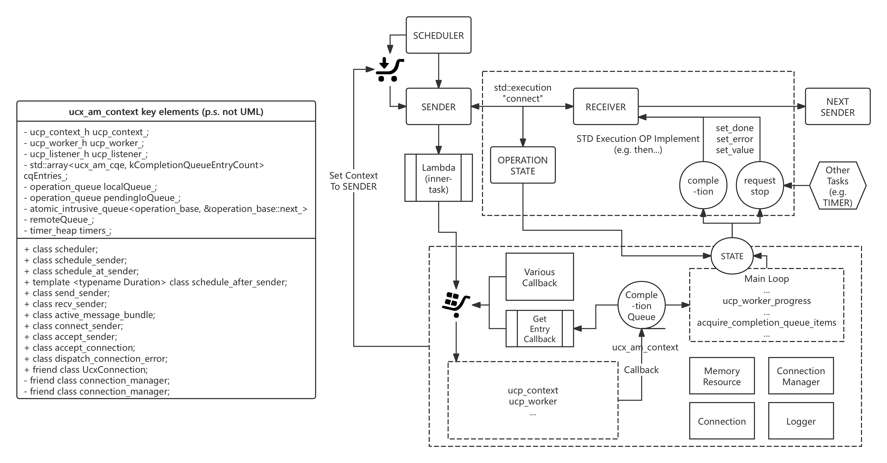

[简体中文](README_Chinese.md)

# execution-ucx

`execution-ucx` is a full-featured OpenUCX runtime context based on the C++26 `P2300` `std::execution` proposal. It is designed to unify all UCX communication tasks (both control plane and data plane) within the `ucx_context`'s worker thread. This approach eliminates lock contention and reduces thread switching, achieving ultimate performance.

This project currently uses Meta's [libunifex](https://github.com/facebookexperimental/libunifex) as the implementation for `std::execution`, but it can be easily switched to NVIDIA's [stdexec](https://github.com/NVIDIA/stdexec) or other compatible implementations.

Its design goal is to provide an efficient, flexible, and composable asynchronous RDMA communication backend for modern C++ applications.



## Core Features

*   **Based on `std::execution`**: Utilizes the latest C++ asynchronous model, offering an expressive and composable API.
*   **High Performance**: All operations are executed in a dedicated `ucx_context` thread, avoiding multithreading synchronization overhead and maximizing UCX performance.
*   **Active Message Support**: Built-in efficient Active Message (`ucx_am_context`) implementation, supporting zero-copy and callback handling.
*   **Connection Management**: Automated connection establishment, caching, and management (`ucx_connection_manager`).
*   **Memory Management**: Integrated UCX memory registration/deregistration (`ucx_memory_resource`), simplifying RDMA operations.
*   **CUDA Support**: Seamless support for CUDA device memory, enabling GPU-Direct RDMA (GDR).
*   **Extensibility**: Modular design allows for easy extension to support new protocols or hardware.
*   **General-Purpose RPC**: A flexible RPC module (`rpc_core`) for type-safe, cross-process function calls, supporting service discovery.

## Core Concepts

*   `ucx_context`: The core component that encapsulates `ucp_worker_h` and drives all asynchronous operations. It has its own thread for polling UCX events and executing tasks.
*   `ucx_am_context`: The Active Message context, providing an interface for sending and receiving Active Messages.
*   `RpcDispatcher`: The central class for registering and invoking RPC functions. It manages function signatures and handles data serialization.
*   `ucx_connection`: Encapsulates `ucp_ep_h`, representing a connection to a remote peer.
*   `ucx_connection_manager`: Manages and reuses `ucx_connection`, handling connection establishment and teardown.
*   `ucx_memory_resource`: A C++ PMR-style memory resource for allocating registered memory that can be used directly by UCX for RDMA operations.

## Dependencies

*   **Bazel**: >= 7.0.0
*   **C++ Compiler**: C++17 support
*   **OpenUCX**: v1.18.1 or later
*   **libunifex**: (default) As the `std::execution` implementation
*   **liburing**: A dependency for `libunifex`
*   **Googletest**: For unit tests
*   **(Optional) CUDA Toolkit**: For building with GPU support
*   **(Optional) Various Communication Interface**: Please modify the [OpenUCX BUILD file](third_party/openucx/BUILD.bazel) to select your preferred options. It is recommended to install the [Nvidia HPC SDK](https://developer.nvidia.com/hpc-sdk)

## Build and Test

The project is built using Bazel.

1.  **Build the project**:
    ```bash
    bazel build //ucx_context:ucx_am_context
    ```

2.  **Run tests (CPU)**:
    ```bash
    bazel test //ucx_context:ucx_am_context_test
    ```

3.  **Run tests (CUDA)**:
    Requires a local installation of the CUDA Toolkit. Bazel will automatically detect it and enable CUDA support.
    ```bash
    bazel test //ucx_context:ucx_am_context_test --@rules_cuda//cuda:enable=True
    ```

## Usage Example

The following is a simplified example demonstrating how to send and receive an Active Message using `ucx_am_context`. It is based on the logic from the `TEST_F(UcxAmTest, SmallMessageTransfer)` test case.
For more details, please refer to the [test code](ucx_context/ucx_am_context_test.cpp)

#### test.cpp
```cpp
#include <netinet/in.h>

#include <cassert>
#include <cstring>
#include <iostream>
#include <memory>
#include <thread>
#include <utility>
#include <vector>

#include <unifex/for_each.hpp>
#include <unifex/inplace_stop_token.hpp>
#include <unifex/on.hpp>
#include <unifex/single.hpp>
#include <unifex/spawn_detached.hpp>
#include <unifex/stop_if_requested.hpp>
#include <unifex/stop_on_request.hpp>
#include <unifex/sync_wait.hpp>
#include <unifex/take_until.hpp>
#include <unifex/task.hpp>
#include <unifex/v2/async_scope.hpp>
#include <unifex/when_all.hpp>

#include "ucx_context/ucx_am_context/ucx_am_context.hpp"
#include "ucx_context/ucx_context_def.h"
#include "ucx_context/ucx_memory_resource.hpp"

// Using declarations for clarity
using stdexe_ucx_runtime::accept_endpoint;
using stdexe_ucx_runtime::active_message_bundle;
using stdexe_ucx_runtime::connect_endpoint;
using stdexe_ucx_runtime::connection_recv;
using stdexe_ucx_runtime::connection_send;
using stdexe_ucx_runtime::DefaultUcxMemoryResourceManager;
using stdexe_ucx_runtime::ucx_am_context;
using stdexe_ucx_runtime::UcxMemoryResourceManager;
using unifex::task;

// Helper to create a socket address
static std::unique_ptr<sockaddr> create_socket_address(
  uint16_t port, bool is_server) {
  sockaddr_in* addr = new sockaddr_in{
    .sin_family = AF_INET,
    .sin_port = htons(port),
    .sin_addr = {.s_addr = htonl(is_server ? INADDR_ANY : INADDR_LOOPBACK)}};
  return std::unique_ptr<sockaddr>(reinterpret_cast<sockaddr*>(addr));
}

int main() {
  // 1. Setup server and client contexts, and run them in separate threads.
  std::unique_ptr<UcxMemoryResourceManager> server_mem_res;
  server_mem_res.reset(new DefaultUcxMemoryResourceManager());
  auto server_context =
    std::make_shared<ucx_am_context>(*server_mem_res, "server");
  unifex::inplace_stop_source server_stop_source;
  std::thread server_thread{
    [&] { server_context->run(server_stop_source.get_token()); }};

  std::unique_ptr<UcxMemoryResourceManager> client_mem_res;
  client_mem_res.reset(new DefaultUcxMemoryResourceManager());
  auto client_context =
    std::make_shared<ucx_am_context>(*client_mem_res, "client");
  unifex::inplace_stop_source client_stop_source;
  std::thread client_thread{
    [&] { client_context->run(client_stop_source.get_token()); }};

  // Allow contexts to initialize
  std::this_thread::sleep_for(std::chrono::milliseconds(100));

  auto server_scheduler = server_context->get_scheduler();
  auto client_scheduler = client_context->get_scheduler();
  unsigned int seed = static_cast<unsigned int>(time(nullptr));
  uint16_t port =
    static_cast<uint16_t>(1024 + (rand_r(&seed) % (65535 - 1024 + 1)));

  // 2. Prepare data for transfer.
  const size_t message_size = 1024;
  std::vector<char> test_data(message_size);
  for (size_t i = 0; i < message_size; ++i) {
    test_data[i] = static_cast<char>(i);
  }

  ucx_am_data send_data{};
  send_data.header.data = test_data.data();
  send_data.header.size = test_data.size();
  send_data.buffer.data = test_data.data();
  send_data.buffer.size = test_data.size();
  send_data.buffer_type = ucx_memory_type::HOST;

  ucx_am_data
    recv_data{};  // An empty descriptor, to be filled by the receiver.
  std::atomic<bool> message_received = false;
  std::atomic<bool> send_success = false;

  // 3. Define the server and client logic as unifex tasks.
  auto server_recv_logic =
    [&](std::vector<std::pair<std::uint64_t, std::error_code>>&&
          conn_id_status_vector) -> task<void> {
    // This call will populate the 'recv_data' struct upon message arrival.
    active_message_bundle bundle =
      co_await connection_recv(server_scheduler, recv_data);
    if (bundle.connection().is_established()) {
      message_received.store(true);
      server_stop_source
        .request_stop();  // Stop the server after receiving one message
      co_await unifex::stop_if_requested();
    }
  };

  auto server_logic = [&]() -> task<void> {
    // take_first from the stream of incoming connections.
    unifex::v2::async_scope scope;
    co_await unifex::for_each(
      unifex::take_until(
        accept_endpoint(
          server_scheduler,
          create_socket_address(port, true),
          sizeof(sockaddr_in)),
        unifex::single(
          unifex::stop_on_request(server_stop_source.get_token()))),
      [&](std::vector<std::pair<std::uint64_t, std::error_code>>&&
            conn_id_status_vector) {
        // Only spawn_detached is available in a not-coroutine function
        unifex::spawn_detached(
          unifex::on(
            server_scheduler,
            server_recv_logic(std::move(conn_id_status_vector))),
          scope);
      });
    co_await scope.join();
  };

  auto client_logic = [&]() -> task<void> {
    auto conn_id = co_await connect_endpoint(
      client_scheduler,
      nullptr,
      create_socket_address(port, false),
      sizeof(sockaddr_in));
    assert(conn_id != 0);

    co_await connection_send(client_scheduler, conn_id, send_data);
    send_success.store(true);
  };

  // 4. Run tasks concurrently and wait for them to complete.
  unifex::sync_wait(unifex::when_all(server_logic(), client_logic()));

  // 5. Verify results.
  assert(message_received.load());
  assert(send_success.load());
  assert(recv_data.header.size == message_size);
  assert(memcmp(recv_data.header.data, test_data.data(), message_size) == 0);
  assert(recv_data.buffer.size == message_size);
  assert(memcmp(recv_data.buffer.data, test_data.data(), message_size) == 0);
  std::cout << "Successfully transferred " << message_size << " bytes."
            << std::endl;

  // 6. Shutdown.
  client_stop_source.request_stop();
  server_thread.join();
  client_thread.join();

  return 0;
}
```

#### BUILD.bazel
```python
cc_binary(
    name = "readme",
    srcs = ["readme.cpp"],
    copts = [
        "-std=c++17",
        "-fcoroutines",
    ],
    linkstatic = False,  # Important for OpenUCX specific library linking
    deps = [
        "@execution-ucx//ucx_context:ucx_am_context",
        "@unifex",
    ],
)
```

## API Reference

This section details the primary APIs provided by `ucx_am_context` for network communication, based on the `std::execution` model. These functions return senders that can be used within coroutines or with `unifex::sync_wait`.

#### Connection Management

*   **`connect_endpoint(scheduler, dst_saddr, addrlen)`**
    *   **Description**: Establishes a connection to a remote peer specified by a socket address.
    *   **Parameters**:
        *   `scheduler`: The `ucx_am_context` scheduler.
        *   `dst_saddr`: A `std::unique_ptr<sockaddr>` for the destination address.
        *   `addrlen`: The length of the socket address.
        *   An optional `src_saddr` can be provided.
    *   **Returns**: A sender that produces a connection ID (`std::uint64_t`) on success.

*   **`connect_endpoint(scheduler, address_buffer)`**
    *   **Description**: Establishes a connection using a remote worker's UCX address.
    *   **Parameters**:
        *   `scheduler`: The `ucx_am_context` scheduler.
        *   `address_buffer`: A `std::vector<std::byte>` containing the remote UCX worker address.
    *   **Returns**: A sender that produces a connection ID (`std::uint64_t`) on success.

*   **`accept_endpoint(scheduler, socket, addrlen)`**
    *   **Description**: Listens for and accepts incoming connections on a given socket address.
    *   **Parameters**:
        *   `scheduler`: The `ucx_am_context` scheduler.
        *   `socket`: A `std::unique_ptr<sockaddr>` for the listening address.
        *   `addrlen`: The length of the socket address.
    *   **Returns**: A sender that produces a `std::vector<std::pair<std::uint64_t, std::error_code>>`, where each pair represents a newly accepted connection's ID and status.

*   **`handle_error_connection(scheduler, handler)`**
    *   **Description**: Registers a handler for connection errors. The handler decides whether to attempt reconnection.
    *   **Parameters**:
        *   `scheduler`: The `ucx_am_context` scheduler.
        *   `handler`: A callable `std::function<bool(std::uint64_t, T)>` where T can be either `ucs_status_t` or `std::error_code`. It receives the connection ID and status. Return `true` to reconnect, `false` to close.
    *   **Returns**: A sender that completes with no value.

#### Data Transfer

*   **`connection_send(scheduler, conn_id, data)`**
    *   **Description**: Sends an Active Message. Overloads exist for different connection identifiers (`conn_pair_t&`, `std::uint64_t`, `UcxConnection&`) and data types (`ucx_am_data&`, `UcxAmData&&`, `ucx_am_iovec&`, `UcxAmIovec&&`).
    *   **Parameters**:
        *   `scheduler`: The `ucx_am_context` scheduler.
        *   `conn_id`: The identifier for the connection.
        *   `data`: The data payload to send. Rvalue versions (`&&`) take ownership.
    *   **Returns**: A sender that completes with no value on success.

*   **`connection_recv(scheduler, data)`**
    *   **Description**: Receives an Active Message.
    *   **Parameters**:
        *   `scheduler`: The `ucx_am_context` scheduler.
        *   `data`: A `ucx_am_data&` to be filled with the received message. An overload takes a `ucx_memory_type` to allocate the buffer internally.
    *   **Returns**: A sender that produces an `active_message_bundle` on success.

*   **`connection_recv_header(scheduler)`**
    *   **Description**: Receives only the header of an incoming message. This is useful for two-phase receive (rendezvous protocol), where the data payload is received in a separate step.
    *   **Parameters**:
        *   `scheduler`: The `ucx_am_context` scheduler.
    *   **Returns**: A sender producing a `std::variant<std::pair<size_t, UcxHeader>, active_message_bundle>`. For rendezvous messages, it contains a key (`size_t`) and the `UcxHeader`. For eager messages, it contains the full `active_message_bundle`.

*   **`connection_recv_buffer(scheduler, am_desc_key, buffer)`**
    *   **Description**: Receives the data payload for a rendezvous message identified by a key.
    *   **Parameters**:
        *   `scheduler`: The `ucx_am_context` scheduler.
        *   `am_desc_key`: The key obtained from `connection_recv_header`.
        *   `buffer`: A `UcxBuffer&&` or `UcxBufferVec&&` to receive the data. An overload takes a `ucx_memory_type` to allocate the buffer internally.
    *   **Returns**: A sender producing an `active_message_buffer_bundle` (for `UcxBuffer`) or `active_message_iovec_buffer_bundle` (for `UcxBufferVec`) on success.

## RPC Framework (`rpc_core`)

On top of the low-level Active Message API, `execution-ucx` provides a high-level, type-safe RPC framework. This allows developers to register C++ functions on a server and call them from a client as if they were local, with automatic serialization of arguments and return values. It also includes a service discovery mechanism.

### Usage Example

This example demonstrates an end-to-end RPC workflow: a server registers a function, and a client discovers it, calls it, and verifies the result.

#### rpc_example.cpp

```cpp
#include <cassert>
#include <iostream>
#include <map>
#include <string>
#include <vector>

#include "rpc_core/rpc_dispatcher.hpp"

// Use declarations for clarity
using stdexe_ucx_runtime::rpc_core::function_id_t;
using stdexe_ucx_runtime::rpc_core::ParamMeta;
using stdexe_ucx_runtime::rpc_core::ParamType;
using stdexe_ucx_runtime::rpc_core::PrimitiveValue;
using stdexe_ucx_runtime::rpc_core::RpcDispatcher;
using stdexe_ucx_runtime::rpc_core::RpcFunctionSignature;
using stdexe_ucx_runtime::rpc_core::RpcRequestHeader;
using stdexe_ucx_runtime::rpc_core::session_id_t;
namespace data = cista::offset;

// A simple function to be exposed via RPC
int add(int a, int b) { return a + b; }

int main() {
  // 1. A mock central registry for service discovery.
  // In a real application, this could be a key-value store like etcd or Redis.
  std::map<std::string, cista::byte_buf> registry;

  // 2. Setup Server B (the service provider).
  // It creates a dispatcher, registers a function, and publishes its
  // signatures.
  RpcDispatcher dispatcher_B("server_B_instance");
  dispatcher_B.register_function(function_id_t{100}, &add,
                                 data::string{"add_func"});

  // Publish signatures to the central registry.
  registry["server_B_instance"] = dispatcher_B.get_all_signatures();
  std::cout << "Server B registered 'add_func' and published its signature."
            << std::endl;

  // 3. Client A (the caller) discovers and calls the function.
  // --- Discovery Phase ---
  auto serialized_sigs_it = registry.find("server_B_instance");
  assert(serialized_sigs_it != registry.end());

  auto deserialized_sigs =
      cista::deserialize<data::vector<RpcFunctionSignature>>(
          serialized_sigs_it->second);
  assert(deserialized_sigs != nullptr);

  std::optional<function_id_t> target_function_id;
  for (const auto& sig : *deserialized_sigs) {
    if (sig.function_name == data::string("add_func")) {
      target_function_id = sig.id;
      break;
    }
  }
  assert(target_function_id.has_value());
  std::cout << "Client A discovered 'add_func' with ID: "
            << target_function_id.value().v_ << std::endl;

  // --- RPC Call Phase ---
  RpcRequestHeader request{};
  request.function_id = target_function_id.value();
  request.session_id = session_id_t{2025};

  ParamMeta p1{};
  p1.type = ParamType::PRIMITIVE_INT32;
  p1.value.emplace<PrimitiveValue>(25);
  request.add_param(std::move(p1));

  ParamMeta p2{};
  p2.type = ParamType::PRIMITIVE_INT32;
  p2.value.emplace<PrimitiveValue>(17);
  request.add_param(std::move(p2));

  auto request_buffer = cista::serialize(request);

  // Simulate sending the request to Server B's dispatcher and receiving a
  // response. In a real system, this buffer would be sent over the network
  // using ucx_am_context.
  auto response_pair = dispatcher_B.dispatch(std::move(request_buffer));
  auto& response_header = response_pair.header;

  // --- Verification Phase ---
  assert(response_header.session_id.v_ == 2025);
  assert(response_header.results.size() == 1);
  int32_t result = response_header.get_primitive<int32_t>(0);
  assert(result == 42); // 25 + 17
  assert(response_header.status.value == 0);

  std::cout << "Client A called 'add_func(25, 17)' and got result: " << result
            << std::endl;
  std::cout << "RPC call successful!" << std::endl;

  return 0;
}
```

#### BUILD.bazel
```python
cc_binary(
    name = "rpc_example",
    srcs = ["rpc_example.cpp"],
    deps = [
        "//rpc_core",
    ],
)
```

### API Reference

This section details the primary APIs provided by `RpcDispatcher`.

*   **`RpcDispatcher(instance_name)`**
    *   **Description**: Constructs an `RpcDispatcher`.
    *   **Parameters**:
        *   `instance_name`: A `data::string` to identify this dispatcher instance, used in function signatures for service discovery.

*   **`register_function(id, func, name)`**
    *   **Description**: Registers a C++ callable (function, lambda, etc.) as an RPC function.
    *   **Parameters**:
        *   `id`: A `function_id_t` (strong type over `uint64_t`) to uniquely identify the function.
        *   `func`: The callable to register.
        *   `name`: A human-readable `data::string` name for the function, used for service discovery.

*   **`dispatch(request_buffer, [input_data])`**
    *   **Description**: Deserializes a request from a buffer, invokes the corresponding function, and returns the result. This overload is for functions that either take no context or take a context by reference (`&`).
    *   **Parameters**:
        *   `request_buffer`: A `cista::byte_buf&&` containing the serialized `RpcRequestHeader`.
        *   `input_data`: (Optional) An lvalue reference to a context object to be passed to the function.
    *   **Returns**: An `RpcInvokeResult` containing the response header and any context object returned by the function.

*   **`dispatch_move(request_buffer, input_data)`**
    *   **Description**: Similar to `dispatch`, but moves the context object into the called function. This is intended for contexts that manage resources and whose ownership should be transferred, such as `UcxBufferVec`.
    *   **Parameters**:
        *   `request_buffer`: A `cista::byte_buf&&` with the serialized request.
        *   `input_data`: An rvalue reference (`&&`) to the context object.
    *   **Returns**: An `RpcInvokeResult` containing the response header and any returned context.

*   **`get_all_signatures()`**
    *   **Description**: Retrieves the signatures of all registered functions and serializes them. This is the core of the service discovery mechanism.
    *   **Returns**: A `cista::byte_buf` containing a serialized `data::vector<RpcFunctionSignature>`. A client can deserialize this buffer to learn about the functions available on the server.

## License

This project is licensed under the [Apache License 2.0](LICENSE) license.

