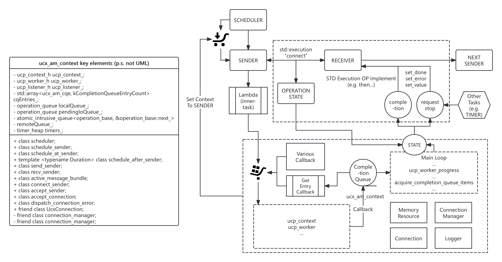

[English](README.md)

# execution-ucx

`execution-ucx` 是一个基于 C++26 `P2300` `std::execution` 提案实现的全功能 OpenUCX 运行时上下文。它旨在将所有 UCX 通信任务（包括控制面和数据面）统一在 `ucx_context` 的工作线程内，通过消除锁竞争和减少线程切换，实现极致的性能。

本项目目前使用 Meta 的 [libunifex](https://github.com/facebookexperimental/libunifex)作为 `std::execution` 的实现，并可轻松切换到 NVIDIA 的 [stdexec](https://github.com/NVIDIA/stdexec) 或其他兼容实现。

其设计目标是为现代 C++ 应用程序提供一个高效、灵活且可组合的异步 RDMA 通信后端。



## 核心特性

*   **基于 `std::execution`**：采用最新的 C++ 异步模型，提供富有表现力且可组合的 API。
*   **高性能**：所有操作都在专用的 `ucx_context` 线程中执行，避免了多线程同步开销，最大化 UCX 的性能。
*   **Active Message 支持**：内置高效的 Active Message (`ucx_am_context`) 实现，支持零拷贝和回调函数处理。
*   **连接管理**：自动化的连接建立、缓存和管理 (`ucx_connection_manager`)。
*   **内存管理**：集成了 UCX 内存注册/反注册 (`ucx_memory_resource`)，简化了 RDMA 操作。
*   **CUDA 支持**：无缝支持 CUDA 设备内存，可实现 GPU-Direct RDMA (GDR)。
*   **可扩展性**：模块化设计，可以轻松扩展以支持新的协议或硬件。

## 核心概念

*   `ucx_context`: 核心组件，封装了 `ucp_worker_h`，并驱动所有异步操作。它拥有一个独立的线程，负责轮询 UCX 事件和执行任务。
*   `ucx_am_context`: Active Message 上下文，提供了发送和接收 Active Message 的接口。
*   `ucx_connection`: 封装了 `ucp_ep_h`，代表一个到远端的连接。
*   `ucx_connection_manager`: 负责管理和复用 `ucx_connection`，处理连接建立和关闭。
*   `ucx_memory_resource`: 一个 C++ PMR 风格的内存资源，用于分配可被 UCX 直接用于 RDMA 操作的注册内存。

## 依赖

*   **Bazel**: >= 7.0.0
*   **C++ Compiler**: 支持 C++17 标准
*   **OpenUCX**: v1.18.1 或更高版本
*   **libunifex**: (默认) 作为 `std::execution` 的实现
*   **(可选) liburing**: `libunifex` 的依赖项
*   **Googletest**: 用于单元测试
*   **(可选) CUDA Toolkit**: 用于构建 GPU 支持
*   **(可选) 各种通信介质**: 请修改[OpenUCX BUILD文件](third_party/openucx/BUILD.bazel)自行选择，推荐安装[Nvidia HPC SDK](https://developer.nvidia.com/hpc-sdk)

## 构建与测试

项目使用 Bazel 进行构建。

1.  **构建项目**:
    ```bash
    bazel build //ucx_context:ucx_am_context
    ```

2.  **运行测试 (CPU)**:
    ```bash
    bazel test //ucx_context:ucx_am_context_test
    ```

3.  **运行测试 (CUDA)**:
    需要本地安装 CUDA Toolkit，Bazel 会自动检测并启用 CUDA 支持。
    ```bash
    bazel test //ucx_context:ucx_am_context_test --@rules_cuda//cuda:enable=True
    ```

## 使用示例

以下是一个简化的示例，展示如何使用 `ucx_am_context` 发送和接收一个 Active Message。该示例基于 `TEST_F(UcxAmTest, SmallMessageTransfer)` 测试用例的逻辑。
详细请参考[测试代码](ucx_context/ucx_am_context_test.cpp)

#### test.cpp
```cpp
#include <netinet/in.h>

#include <cassert>
#include <cstring>
#include <iostream>
#include <memory>
#include <thread>
#include <utility>
#include <vector>

#include <unifex/for_each.hpp>
#include <unifex/inplace_stop_token.hpp>
#include <unifex/on.hpp>
#include <unifex/single.hpp>
#include <unifex/spawn_detached.hpp>
#include <unifex/stop_if_requested.hpp>
#include <unifex/stop_on_request.hpp>
#include <unifex/sync_wait.hpp>
#include <unifex/take_until.hpp>
#include <unifex/task.hpp>
#include <unifex/v2/async_scope.hpp>
#include <unifex/when_all.hpp>

#include "ucx_context/ucx_am_context/ucx_am_context.hpp"
#include "ucx_context/ucx_context_def.h"
#include "ucx_context/ucx_memory_resource.hpp"

// 使用声明以提高代码清晰度
using stdexe_ucx_runtime::accept_endpoint;
using stdexe_ucx_runtime::active_message_bundle;
using stdexe_ucx_runtime::connect_endpoint;
using stdexe_ucx_runtime::connection_recv;
using stdexe_ucx_runtime::connection_send;
using stdexe_ucx_runtime::DefaultUcxMemoryResourceManager;
using stdexe_ucx_runtime::ucx_am_context;
using stdexe_ucx_runtime::UcxMemoryResourceManager;
using unifex::task;

// 辅助函数：创建套接字地址
static std::unique_ptr<sockaddr> create_socket_address(
  uint16_t port, bool is_server) {
  sockaddr_in* addr = new sockaddr_in{
    .sin_family = AF_INET,
    .sin_port = htons(port),
    .sin_addr = {.s_addr = htonl(is_server ? INADDR_ANY : INADDR_LOOPBACK)}};
  return std::unique_ptr<sockaddr>(reinterpret_cast<sockaddr*>(addr));
}

int main() {
  // 1. 设置服务器和客户端上下文，并在单独的线程中运行它们
  std::unique_ptr<UcxMemoryResourceManager> server_mem_res;
  server_mem_res.reset(new DefaultUcxMemoryResourceManager());
  auto server_context =
    std::make_shared<ucx_am_context>(server_mem_res, "server");
  unifex::inplace_stop_source server_stop_source;
  std::thread server_thread{
    [&] { server_context->run(server_stop_source.get_token()); }};

  std::unique_ptr<UcxMemoryResourceManager> client_mem_res;
  client_mem_res.reset(new DefaultUcxMemoryResourceManager());
  auto client_context =
    std::make_shared<ucx_am_context>(client_mem_res, "client");
  unifex::inplace_stop_source client_stop_source;
  std::thread client_thread{
    [&] { client_context->run(client_stop_source.get_token()); }};

  // 允许上下文初始化
  std::this_thread::sleep_for(std::chrono::milliseconds(100));

  auto server_scheduler = server_context->get_scheduler();
  auto client_scheduler = client_context->get_scheduler();
  unsigned int seed = static_cast<unsigned int>(time(nullptr));
  uint16_t port =
    static_cast<uint16_t>(1024 + (rand_r(&seed) % (65535 - 1024 + 1)));

  // 2. 准备传输数据
  const size_t message_size = 1024;
  std::vector<char> test_data(message_size);
  for (size_t i = 0; i < message_size; ++i) {
    test_data[i] = static_cast<char>(i);
  }

  ucx_am_data send_data{};
  send_data.header = test_data.data();
  send_data.header_length = test_data.size();
  send_data.data = test_data.data();
  send_data.data_length = test_data.size();
  send_data.data_type = ucx_memory_type::HOST;

  ucx_am_data
    recv_data{};  // 空描述符，将由接收方填充
  std::atomic<bool> message_received = false;
  std::atomic<bool> send_success = false;

  // 3. 将服务器和客户端逻辑定义为unifex任务
  auto server_recv_logic =
    [&](std::vector<std::pair<std::uint64_t, ucs_status_t>>&&
          conn_id_status_vector) -> task<void> {
    // 此调用将在消息到达时填充'recv_data'结构
    active_message_bundle bundle =
      co_await connection_recv(server_scheduler, recv_data);
    if (bundle.connection().is_established()) {
      message_received.store(true);
      server_stop_source
        .request_stop();  // 接收一条消息后停止服务器
      co_await unifex::stop_if_requested();
    }
  };

  auto server_logic = [&]() -> task<void> {
    // 从传入连接流中获取第一个
    unifex::v2::async_scope scope;
    co_await unifex::for_each(
      unifex::take_until(
        accept_endpoint(
          server_scheduler,
          create_socket_address(port, true),
          sizeof(sockaddr_in)),
        unifex::single(
          unifex::stop_on_request(server_stop_source.get_token()))),
      [&](std::vector<std::pair<std::uint64_t, ucs_status_t>>&&
            conn_id_status_vector) {
        // 在非协程函数中只能使用spawn_detached
        unifex::spawn_detached(
          unifex::on(
            server_scheduler,
            server_recv_logic(std::move(conn_id_status_vector))),
          scope);
      });
    co_await scope.join();
  };

  auto client_logic = [&]() -> task<void> {
    auto conn_id = co_await connect_endpoint(
      client_scheduler,
      nullptr,
      create_socket_address(port, false),
      sizeof(sockaddr_in));
    assert(conn_id != 0);

    co_await connection_send(client_scheduler, conn_id, send_data);
    send_success.store(true);
  };

  // 4. 并发运行任务并等待它们完成
  unifex::sync_wait(unifex::when_all(server_logic(), client_logic()));

  // 5. 验证结果
  assert(message_received.load());
  assert(send_success.load());
  assert(recv_data.header_length == message_size);
  assert(memcmp(recv_data.header, test_data.data(), message_size) == 0);
  assert(recv_data.data_length == message_size);
  assert(memcmp(recv_data.data, test_data.data(), message_size) == 0);
  std::cout << "成功传输 " << message_size << " 字节。" << std::endl;

  // 6. 关闭
  client_stop_source.request_stop();
  server_thread.join();
  client_thread.join();

  return 0;
}
```

#### BUILD.bazel
```python
cc_binary(
    name = "readme",
    srcs = ["readme.cpp"],
    copts = [
        "-std=c++17",
        "-fcoroutines",
    ],
    linkstatic = False,  # 对于OpenUCX特定库链接很重要！
    deps = [
        "@execution-ucx//ucx_context:ucx_am_context",
        "@unifex",
    ],
)
```

## 许可证

本项目采用 [Apache License 2.0](LICENSE) 许可证。 